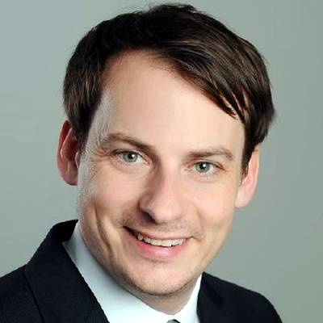

# Dennis Kasper

**Software Engineer**

Munich, Germany

[Email](mailto:dennis.m.kasper@gmail.com) | [LinkedIn](https://linkedin.com/in/denniskasper) | [GitHub](https://github.com/denniskasper) | [denniskasper.com](https://denniskasper.com)

## About Me

Software Engineer combining full stack development expertise with a computational mechanics foundation. 5+ years building cloud infrastructure on AWS, with strong Python skills for serverless development and automation. Hands-on experience with the full Lambda workflow—local development with AWS SAM, infrastructure as code with Terraform, and deployment to production. Background in engineering simulation provides practical experience in data transformation, validation, and working with large-scale datasets.

## Work Experience

### Full Stack Web Developer/DevOps Engineer — FEV EVA GmbH

_Jan. 2021 – Present_ — Hybrid, Munich

- Built a battery test data platform from scratch serving 10-50 department users, using Angular for the frontend and Express.js for the backend API.
- Integrated platform with Jira via REST API for automated ticket tracking and workflow management.
- Designed and implemented ETL pipelines for processing and transforming battery test data into structured formats for analysis and visualization.
- Set up cloud infrastructure on AWS (Lambda, RDS, S3) using Terraform, enabling reproducible deployments across environments.
- Implemented CI/CD pipelines with GitHub Actions, automating build, test, and deployment workflows.
- Designed PostgreSQL database schema for efficient storage and querying of test data.

### CFD/FEM Simulation Engineer — FEV EVA GmbH

_Nov. 2016 – Dec. 2020 · 4 Years_ — On-site, Munich

- Delivered thermal-electro-chemical simulations for lithium-ion battery design in BEV and PHEV programs, using FEM for thermal analysis and CFD for electro-chemical modeling.
- Developed Python and MATLAB scripts for automated pre- and post-processing of simulation data, including visualization and reporting.
- Applied Model Order Reduction (MOR) techniques in ANSYS to improve computational efficiency for complex battery system analysis.
- Built a prototype diagnostic tool using Raspberry Pi and CAN Bus (python-can) to read error memory from high-voltage battery storage.
- Created a React-based UI for the diagnostic tool, enabling intuitive interaction with the hardware.

### Research Assistant — ILEK, University of Stuttgart

_Oct. 2011 – Sept. 2013 · 2 Years_

- Contributed to the construction of the Stuttgart SmartShell prototype, an adaptive lightweight structure demonstrator at ILEK.
- Conducted research on adaptive concrete structures and model reduction techniques for structural simulations.

## Education

### M.Sc. Computational Mechanics — Technical University of Munich

- _2013 – 2016_  
  _Thesis: Discrete Adjoint Approach to the Spalart-Allmaras Turbulence Model (OpenFOAM)_  
  [GitHub Repository](https://github.com/denniskasper/OpenFOAM301)

### M.Eng. Civil Engineering — Hochschule Biberach

- _2009 – 2011_  
  _Thesis: Fluid Flow Simulations in Paint Drying Ovens (P+Z Engineering GmbH)_

## Skills

- Languages: Python, SQL, TypeScript, JavaScript, MATLAB
- Cloud & DevOps: AWS (Lambda, S3, RDS, EC2), Terraform, Docker, GitHub Actions, CI/CD, Linux
- Data & APIs: ETL pipelines, REST APIs, JSON, PostgreSQL, data modeling
- Frameworks: FastAPI, Flask, Express, Node.js, React, Angular
- Simulation: FEM, CFD, ANSYS, OpenFOAM
- Embedded Systems: Raspberry Pi, CAN-Bus

## Certifications

- Deep Learning Specialization — Coursera
- TensorFlow in Practice — Coursera

## Awards

- BDB-Buchpreis — For outstanding academic achievements, 2011
  _(Bund Deutscher Baumeister Architekten und Ingenieure BW e.V.)_

## Languages

- German – Native
- English – Proficient / Business Fluent
